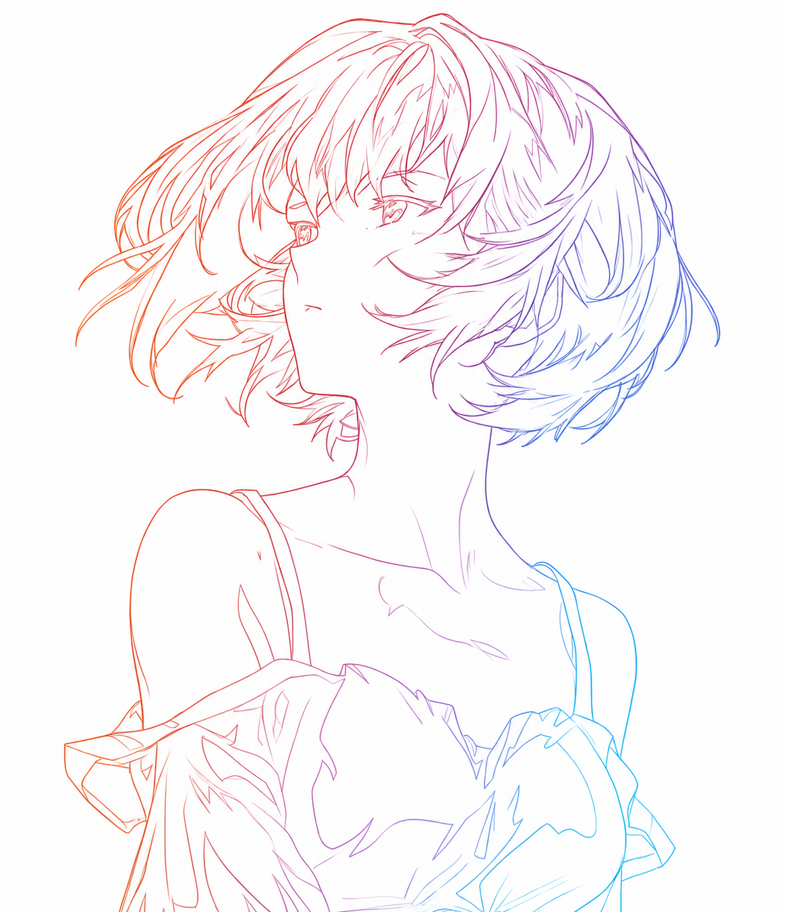

> 
<em>
>      
>     Code is poetry, logic is art, weaving eternity in the world of 0s and 1s.
>      
>     每一行代码都是对完美的追求，每一次编译都是向理想的致敬。
>      
>     Every line of code is a pursuit of perfection, every compilation a tribute to ideals.
> </em>

> 

>     &mdash;&mdash;&mdash;《The Programmer's Creed》
> 

---

_⚡ Computer Science enthusiast, focusing on backend development with **Rust** and **Go**.  ⚡_

_In the realm of systems programming, where performance meets reliability, I craft solutions that stand the test of time. Building robust backends, one commit at a time._

_Core Contributor of **[@ascentstream/pulsar-lite](https://github.com/ascentstream/pulsar-lite)**_

_Plugin and Component Developer of **[@esengine/DeepSeek-Reasonix](https://github.com/esengine/DeepSeek-Reasonix)**_

<em>Hello, fellow developer! May your code compile without warnings and your deployments be ever smooth. 🚀</em>

<table align="center" width="100%">
  <tr>
    <td align="center" width="50%" valign="top">
      
    </td>
    <td align="center" width="50%" valign="top">
      
    </td>
  </tr>
</table>

